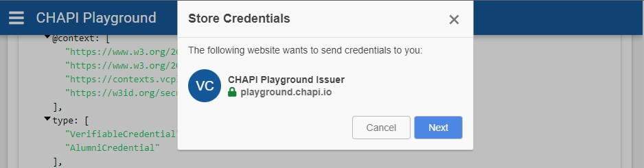

# {{ page.title }}

The [CHAPI Playground](https://playground.chapi.io/) supports the delivery of
`QueryByExample` requests for doing Multi-Credential Verification as a
[Verifiable Credential Verifier](./).

## Wallet Sign Up
If you already have a CHAPI-enabled digital wallet ([Veres Wallet](https://demo.vereswallet.dev/), [LearnCard](https://learncard.app/), etc.), you can skip to the [VC Issuance section](#vc-issuance).

Here's how to get a demo Veres Wallet if you need one:

1. Visit <https://demo.vereswallet.dev/> and click "Try Veres Wallet".

2. Use an email address that you can access. The Veres Wallet supports email address tags, so you can modify a valid email address by adding "+chapi" to create multiple accounts: myname+chapi@example.com The "+chapi" can be anything you like and you can use this approach to make multiple accounts at a single email address.

3. Once you click "Register", you'll receive an "Allow Wallet" modal. Make sure to click "Allow" on that modal, so the wallet can handle credentials on your behalf.

Once that's done, proceed to Verifiable Credential Issuance.

## Verifiable Credential Issuance

First, visit [the Issuer section of the playground](https://playground.chapi.io/issuer).

Next, select the "Alumni" icon in the top "Select a credential to issue" section as shown below:

The credential JSON below is similar to what will be passed to the issuer to generate the credential.



Now, lets issue the credential. Click "Issue Verifiable Credential" to proceed to the (optional) DID Authentication screen.

Once you've completed DID Authentication (or not), you'll be provided with the Verifiable Credential JSON.



**NOTE:** The credential JSON document now has an absolute URL for it's `id` value and a new `proof` section. The `issuer.id` has also been updated to reflect the playground as the Issuer, and (of course) the `issuanceDate` has also been set.

That credential may now be stored in a wallet. Click "Store in Wallet" to proceed.

A modal will appear - similar to the one below - explaining that the playground wants to send the cerdential for you.

Clicking "Next" should present you with a list of available wallets:

However, if you instead receive a browser window popup warning you that you do not yet have one set up, you will need to return to the [Wallet Sign Up section](#wallet-sign-up) above.

If you received a list of wallet options, pick the one you prefer by clicking on it's name to proceed.

Each wallet will have it's own system for displaying the credential and offering to store it for you.

Once you've clicked "Store" in your preferred wallet system, you will be brought back to the main playground screen.

Follow the above process a few more times by clicking "Issuer Demo" to load your wallet with more example credentials.

## Multiple VC Verification

Now that you have several VCs in your wallet, let's get them all verified in one request.

1. Visit the playground's Verifier section at <https://playground.chapi.io/verifier>.

2. Click each of the VCs you loaded into your wallet (i.e. "Alumni", "JFF x vc-edu PF3", and "Permanent Resident" for example).

3. Click "Request Verifiable Presentation" to request that your wallet share these credentials.

4. In the demo Veres Wallet you'll see each of the credentials you selected (plus the ability to select which ones you want to verify). Click the "Share" button to send them to the playground for verification.

5. The process should end with a VerifiablePresentation JSON document and the words "Presentation Verified".

Note that if you pick a credential that you didn't first load into your demo wallet, you'll receive a "Sorry, we can't seem to find any credentials" message. Additionally, you may find a different credential presented if it contains the requested data needed for verification.
